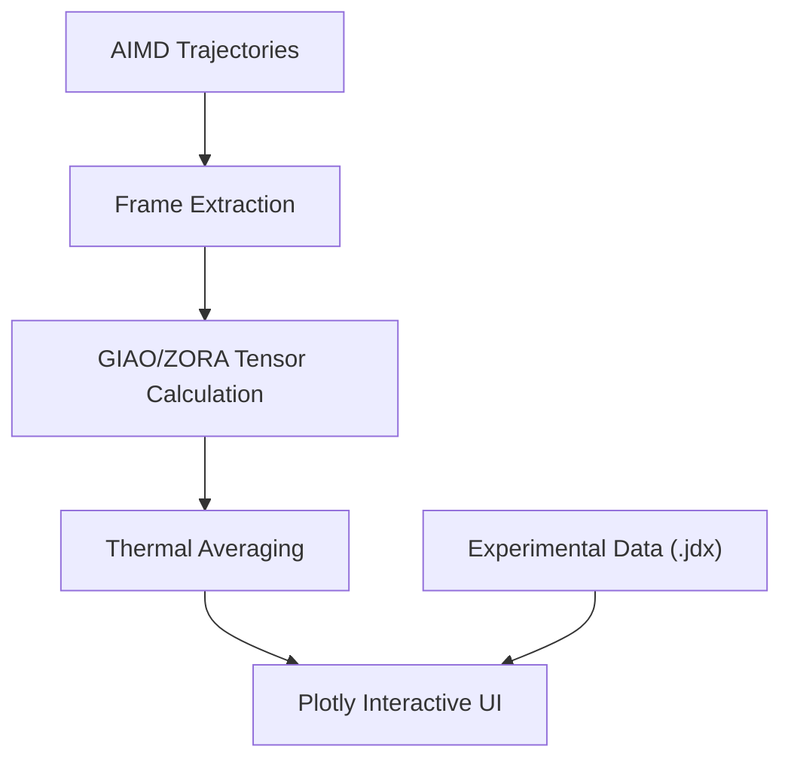

# CoChem-SHIFT: Dynamic NMR Spectroscopy Engine

## PI & Metadata
- **PI/Developer:** Dr. Joshua John Klaassen
- **ORCiD:** [0009-0007-1506-4401](https://orcid.org/0009-0007-1506-4401)
- **GitHub Organization:** [ProfJJK-CoChem](https://github.com/ProfJJK-CoChem)
- **CoChem User Manual:** [CoChem_User_Manual.md](https://github.com/ProfJJK-CoChem/CoChem-BASE/blob/main/CoChem_User_Manual.md)
- **Method Matrix:** [Method_Matrix.md](https://github.com/ProfJJK-CoChem/CoChem-BASE/blob/main/Method_Matrix.md)

*Note: CoChem has recently migrated to the Valeev Stack (MPQC, F12) for all core calculations, dramatically refining the accuracy of underlying molecular properties [M].*

## What This Repository Does
**CoChem-SHIFT** is the dedicated module for predicting and analyzing dynamic NMR spectroscopy parameters. It moves beyond rigid-rotor approximations by dynamically incorporating thermal averaging and highly robust relativistic corrections.

Key capabilities include:
- **Advanced Tensor Predictions:** Implements Gauge-Independent Atomic Orbitals (GIAO) alongside Zero-Order Regular Approximation (ZORA) relativistic corrections to compute exact magnetic shielding tensors.
- **Optimized Basis Sets:** Mandates property-optimized core-polarization basis sets (e.g., `pcSseg-2`) for superior spin-spin coupling accuracy [M].
- **Dynamic Thermal Averaging:** Extracts over 100+ [E] frames from AIMD trajectories to capture the true fluxional behavior of molecules.
- **Interactive Triage UI:** Delivers highly interactive 1D Plotly UI elements with Peak-to-Atom dynamic mapping and seamless JCAMP-DX (`.jdx`) experimental overlays for visual validation.

### Data Flow Architecture

## Setup & Installation
1. Clone the repository: `git clone https://github.com/ProfJJK-CoChem/CoChem-SHIFT.git`
2. Ensure you have the standard CoChem dependencies along with `plotly` installed.
3. Confirm that your quantum backend is configured to support ZORA operators and GIAO calculations.

## Getting Started
1. Ensure the upstream modules (e.g., AIMD engines) have populated the required coordinate frames.
2. Launch the main script: `python cochem_shift_engine.py` to calculate the dynamic tensors.
3. Use `cochem_shift_report.py` to spawn the interactive Plotly server and overlay your experimental `.jdx` spectra.
Consult the [User Manual](https://github.com/ProfJJK-CoChem/CoChem-BASE/blob/main/CoChem_User_Manual.md) for full workflow and configuration parameters.

---
